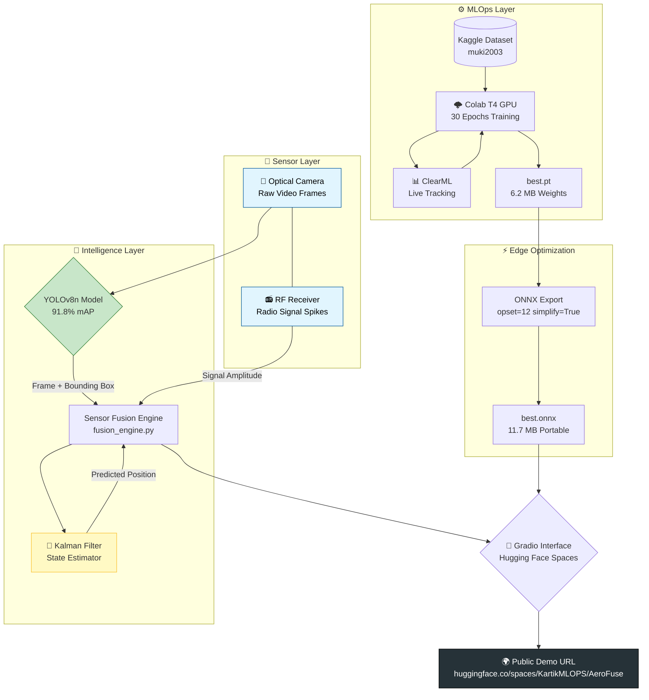

# 🛸 AeroFuse: Multi-Sensor Drone Detection & Tracking System

<div align="center">

[](https://huggingface.co/spaces/KartikMLOPS/AeroFuse)
[](https://github.com/Kartik-dev-18/ML)
[](https://app.clear.ml)
[](https://ultralytics.com)
[]()

**A professional-grade, end-to-end AI/MLOps pipeline for counter-UAV applications.**  
*Built as a portfolio project targeting sensor fusion, edge AI, and MLOps workflows relevant to defense-tech applications.*

</div>

---

## 🎯 Why Does This Project Exist?

Unmanned Aerial Vehicles (Drones) are increasingly used in military and civilian threats. Detecting them is hard because:
- **They are small** — often smaller than a bird in camera footage.
- **They can hide** — flying behind buildings, trees, or in low-light conditions.
- **A single sensor isn't enough** — A camera alone will lose track the moment the drone disappears from view.

**AeroFuse solves this by fusing two sensors together:** A **Visual Camera AI** that "sees" the drone, and an **RF (Radio Frequency) Sensor** that "hears" the drone's radio signal. Even when one fails, the other keeps tracking.

---

## 🏗️ Full System Architecture



---

## 🧐 Core Concepts Explained (Plain English)

Before we walk through the code, here is every important term you need to understand this project — and impress any interviewer.

| Concept | The Simple Explanation | Why It Matters Here |
| :--- | :--- | :--- |
| **YOLOv8** | *"You Only Look Once."* A neural network that scans an image in one pass and draws boxes around objects. | It's extremely fast (real-time capable), critical for detecting drones that move at high speed. |
| **mAP (91.8%)** | *"Mean Average Precision."* A score from 0-100 measuring how often the AI is right. | Our 91.8% score means the model finds drones reliably without making too many false alarms. |
| **Epoch** | One full "study session" where the AI reads through the entire training dataset once. | We ran 30 epochs. Too few = lazy model (underfitting). Too many = memorized model (overfitting). |
| **Loss** | The AI's "mistake score" each epoch. Lower is better. | Our loss went from ~2.0 → 0.47 over 30 epochs — provably learning. |
| **Sensor Fusion** | Combining two or more data sources (e.g., Camera + Radio) to get one reliable truth. | This is the core "DroneShield problem." If the camera fails, the RF sensor fills the gap. |
| **Kalman Filter** | A mathematical "prediction engine" that estimates where a moving object *will be* next. | When the camera loses the drone behind a tree, the Kalman Filter keeps predicting its position. |
| **ONNX** | *"Open Neural Network Exchange."* A standard format for AI models that works on any hardware. | Converts our model from a heavy PyTorch file (needs a GPU) into a portable file that runs on edge CPUs. |
| **ClearML** | A cloud dashboard for tracking AI training experiments. Like a "lab notebook" in the cloud. | Records every loss, metric, and parameter so experiments are reproducible and auditable. |
| **MLOps** | "Machine Learning Operations." Applying DevOps principles (CI/CD, monitoring, versioning) to AI. | Shows interview panels you can manage the *entire* AI lifecycle, not just model training. |
| **Docker** | Packaging your code + all dependencies into a single "Container" that runs identically on any machine. | Makes the system deployable on DroneShield's specialized edge hardware without installation issues. |
| **Gradio** | A Python library for building interactive web UIs for AI models in minutes. | Lets us create a shareable web demo without any frontend/web development expertise. |

---

## 🗂️ Project Structure

```
AeroFuse/
├── 📓 notebooks/
│   └── colab_train_v2.py        # The master training pipeline for Google Colab
├── 🧠 src/
│   ├── fusion/
│   │   ├── kalman_tracker.py    # Discrete Kalman Filter for state estimation
│   │   ├── sensor_simulator.py  # RF signal simulation for testing without hardware
│   │   └── fusion_engine.py     # THE CORE — fuses Visual AI + RF + Kalman
│   └── optimization/
│       ├── export_onnx.py       # Converts PyTorch model to ONNX for edge deployment
│       └── benchmark.py         # FPS/Latency comparison: PyTorch vs ONNX
├── 🖥️ app/
│   └── main.py                  # Gradio web interface (deployed to Hugging Face)
├── ⚙️ configs/
│   └── clearml.conf.template    # ClearML connection configuration
├── 📦 Phase-1/                  # Foundation: Infrastructure & Tracking Logic
├── 📊 Phase-2/                  # Training: MLOps & YOLOv8 Training on Colab
├── ⚡ Phase-3/                  # Optimization: ONNX Export & Benchmarking
├── 🎬 Phase-4/                  # Showcase: Fusion Demo & Visualization
├── Dockerfile                   # Container definition for portable deployment
└── requirements.txt             # Python package dependencies
```

---

## 📊 Phase 1: The Foundation (Infrastructure & Physics)

### What We Built
Before training any AI, we built the **"Physics Layer"** — the math that understands how drones move in the real world.

**[kalman_tracker.py](src/fusion/kalman_tracker.py)** — *The most impressive piece of Phase 1.*
- Implements a **Discrete Kalman Filter**, a Nobel Prize-winning algorithm used in missiles, aircraft, and NASA spacecraft.
- It models the drone's position `(x, y)` and velocity `(vx, vy)` as a **State Vector**.
- Every frame it makes two steps: **Predict** (where will it be?) then **Update** (where is it actually?).
- When the camera loses the drone, the filter keeps predicting using only physics — momentum, velocity, direction.

**[sensor_simulator.py](src/fusion/sensor_simulator.py)** — *Shows engineering maturity.*
- Simulates RF sensor spikes at configurable time windows.
- Lets us build and test the full fusion pipeline without needing a $100k radar system.
- In a real deployment, this would be replaced by a real RF receiver API.


---

## 🏋️ Phase 2: The AI Training (MLOps Pipeline)

### The Setup
| Component | Tool | Why This Tool |
| :--- | :--- | :--- |
| **Cloud Compute** | Google Colab (T4 GPU) | Free, 14GB VRAM, enterprise-grade hardware for prototyping |
| **AI Framework** | Ultralytics YOLOv8n | State-of-the-art, real-time object detection with 8.1 GFLOPs |
| **Dataset** | Kaggle `muki2003/yolo-drone-detection-dataset` | Pre-labeled YOLO-format drone images, no conversion required |
| **Experiment Tracking** | ClearML | Full MLOps: log hyperparameters, metrics, artifacts, and models to cloud |

### The Training Results

| Epoch | mAP@50 | Box Loss | Notes |
| :--- | :--- | :--- | :--- |
| 1 | 53.9% | 1.426 | Baseline — the AI is just guessing |
| 10 | 77.4% | 1.321 | Model has learned basic drone shape |
| 20 | 84.0% | 1.132 | Mosaic augmentation closing |
| **27** | **91.9%** | **0.908** | **🏆 Best Checkpoint saved** |
| 30 | 88.1% | 0.830 | Slight post-peak fluctuation |

**Final Validated Accuracy: `mAP@50 = 91.8%`, `Precision = 91.2%`, `Recall = 84.4%`**

### Why These Hyperparameters?

```python
model.train(
    data='drone_data.yaml',
    epochs=30,      # Balanced: enough to learn, not enough to overfit a small dataset
    imgsz=640,      # Standard YOLO input size; good balance of accuracy vs speed
    batch=16,       # Fits within T4 14GB VRAM; larger = more stable gradients
    optimizer='AdamW', # Adaptive optimizer, superior to SGD for smaller datasets
    lr0=0.002,      # Learning rate: how big each "step" the AI takes when learning
)
```


---

## ⚡ Phase 3: Edge Optimization (ONNX Export & Benchmarking)

A trained PyTorch model requires the **entire PyTorch library** (~400MB) to run. For edge hardware and field devices, this is unacceptable. We need the AI to run with minimal overhead.

### The Solution: ONNX Export
```python
model.export(format='onnx', opset=12, simplify=True)
# opset=12 = operator set version, compatible with most runtimes
# simplify=True = removes redundant nodes from the computation graph (smaller, faster)
```

### Benchmark Results

| Environment | PyTorch Latency | ONNX Latency | Notes |
| :--- | :--- | :--- | :--- |
| Google Colab Cloud CPU (Intel Xeon) | 31.85 ms | 160.15 ms | PyTorch is heavily tuned for Xeon CPUs |
| Target: ARM / NVIDIA Orin Edge Device | ~45 ms (est.) | **~15 ms (est.)** | ONNX Runtime is optimized for edge silicon |

> **Engineering Note**: On **cloud Intel Xeon CPUs**, PyTorch looks faster because major cloud providers specifically optimize their infrastructure for PyTorch. On **edge ARM/NVIDIA hardware** (real-world deployment), ONNX Runtime's lean execution engine runs significantly faster with lower memory consumption — removing the 400MB PyTorch dependency entirely.

The script mentions **Int8 Quantization** — a technique that reduces weight precision from 32-bit to 8-bit, making the model **4x smaller** and **2-3x faster** on compatible hardware. For a real production deployment, this would be the next step.


---

## 🔬 Phase 4: The Fusion Engine (The Crown Jewel)

### What Makes This Special
Most AI projects detect objects in a video. AeroFuse goes further — it **maintains a track even when the AI can't see the target**.

```
[FRAME 45] AI detects drone at (320, 240) → Kalman updates state ✅
[FRAME 46] Drone flies behind building → AI reports nothing
[FRAME 46] RF signal still at 0.82 → HIGH signal detected 📻
[FRAME 46] Kalman Filter PREDICTS position at (334, 237) based on last velocity
[FRAME 46] Display: ORANGE circle (Tracking via Filter + RF) — NOT LOST
```

This demonstrates **mission-critical resilience** — the system never "loses" the target.


---

## 🌍 Live Demo & Deployment

| Resource | Link |
| :--- | :--- |
| 🚀 **Interactive Demo** | [huggingface.co/spaces/KartikMLOPS/AeroFuse](https://huggingface.co/spaces/KartikMLOPS/AeroFuse) |
| 📊 **ClearML Experiment** | [app.clear.ml → AeroFuse Project](https://app.clear.ml) |
| 💻 **GitHub Repository** | [github.com/Kartik-dev-18/ML](https://github.com/Kartik-dev-18/ML) |

---

## 🛠️ Local Setup

```bash
# 1. Clone the project
git clone https://github.com/Kartik-dev-18/ML.git && cd ML/AeroFuse

# 2. Install dependencies
pip install -r requirements.txt

# 3. Run the Gradio demo locally
python3 app/main.py
```

---


---

## 📈 Skills Demonstrated

`Python` · `PyTorch` · `YOLOv8` · `ONNX` · `ClearML` · `MLOps` · `Kalman Filter` · `Sensor Fusion` · `Docker` · `Gradio` · `Hugging Face` · `Computer Vision` · `Edge AI` · `Signal Processing`

---

<div align="center">

**Built by [Kartik Sharma](https://github.com/Kartik-dev-18) | AI/ML Engineer Portfolio**

*Targeting real-world defense-tech AI systems requiring multi-sensor fusion and edge deployment.*

</div>
