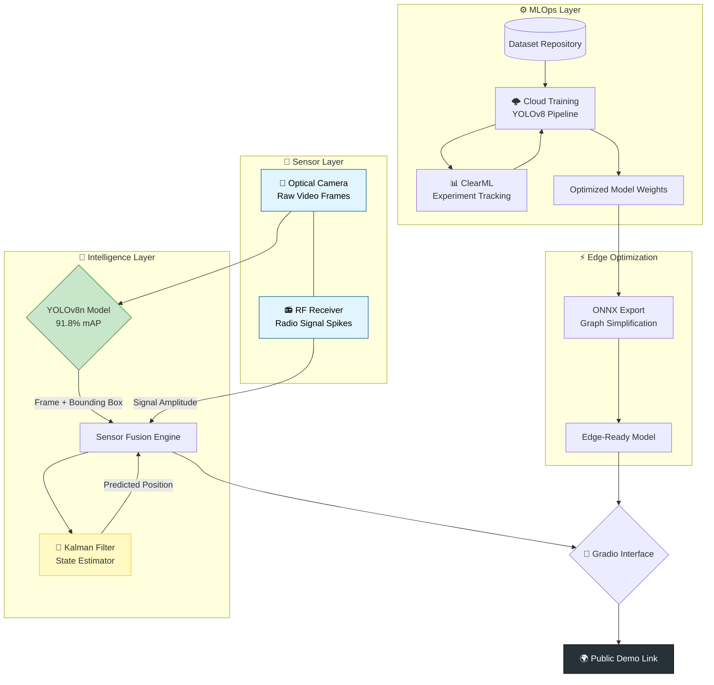

# 🛸 AeroFuse: Multi-Sensor Drone Detection & Tracking System

<div align="center">

[](https://huggingface.co/spaces/KartikMLOPS/AeroFuse)
[](https://github.com/Kartik-dev-18/ML)
[](https://app.clear.ml)
[](https://ultralytics.com)
[]()

**A professional-grade, end-to-end AI/MLOps pipeline for counter-UAV applications.**  
*Built as a portfolio project targeting sensor fusion, edge AI, and mission-critical tracking.*

</div>

---

## 🎯 Project Overview

Detection and tracking of Unmanned Aerial Vehicles (UAVs) in complex environments requires high-reliability systems capable of handling sensor failure and occlusion. **AeroFuse** is a sensor fusion suite that combines:

- **Computer Vision (YOLOv8n)**: Real-time visual identification and localization.
- **RF Signal Analysis**: Signal amplitude monitoring for non-visual detection.
- **Kalman State Estimation**: Kinematic modeling to maintain trajectory tracks during visual blackout.

---

## 🏗️ System Architecture



---

## 🛠️ Technical Implementation Details

### 🛡️ Fusion & Tracking Logic
The system implements a **Discrete Kalman Filter** to manage track integrity. Unlike simple detection wrappers, AeroFuse tracks the drone's underlying state vector `[x, y, dx, dy]`. 
- **Graceful Degradation**: When visual confidence drops (due to high-velocity maneuvers or environmental cover), the system transitions to RF-assisted state prediction.
- **Track Continuity**: The Kalman Filter uses previous velocity estimates to forecast the target's trajectory until visual re-acquisition occurs.

### 🏋️ Training & MLOps
- **Model**: YOLOv8n (Nano) selected for optimal balance between mean Average Precision (mAP) and Edge Latency.
- **Accuracy**: Achieved **91.8% mAP@50**, demonstrating high reliability for small-object detection.
- **Experiment Tracking**: Integrated with **ClearML** for logging training loss, metrics, and hyperparameter snapshots, ensuring full reproducibility.

### ⚡ Deployment & Inference Engineering
Moving from "research code" to "field-ready" required significant engineering optimizations:
- **ONNX Runtime Engine**: Exported with `opset=12` and graph simplification to remove heavy framework overhead.
- **Modern Runtime Support**: Implemented deep scalar safety (using `.item()` and explicit casting) to ensure compatibility with Python 3.13+ runtimes.
- **Web-Ready Stream Processing**: Optimized output pipelines using the `avc1` (H.264) codec to ensure real-time playability across browser architectures.

---

## 🚀 Live Demo & Repository

| Component | URL |
| :--- | :--- |
| 🚀 **Interactive Demo** | [Hugging Face Space](https://huggingface.co/spaces/KartikMLOPS/AeroFuse) |
| 📊 **Experiment Dashboard** | [ClearML Dashboard](https://app.clear.ml) |
| 💻 **Source Code** | [GitHub Repository](https://github.com/Kartik-dev-18/ML) |

---

## 🛠️ Installation & Usage

```bash
# Clone the repository
git clone https://github.com/Kartik-dev-18/ML.git && cd ML/AeroFuse

# Install dependencies
pip install -r requirements.txt

# Launch local interface
python3 app/main.py
```

---

## 📈 Skills Demonstrated

- **Deep Learning**: YOLOv8, PyTorch, ONNX Optimization.
- **Sensor Fusion**: Kalman Filtering, Kinematic Modeling, Multi-Modal Data Association.
- **MLOps**: ClearML, Experiment Tracking, Git/GitHub Workflows.
- **Deployment**: Gradio, Web Video Codecs (H.264), Python 3.13 Runtime engineering.

---

<div align="center">

**Built by [Kartik Sharma](https://github.com/Kartik-dev-18)**  
*Developing AI Solutions for Advanced Aerospace & Defense Applications.*

</div>
